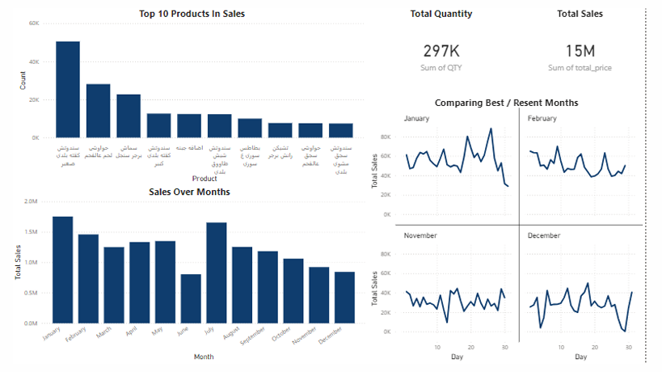

# 📊 Sales Analysis & Product Performance

This project analyzes real sales data to uncover trends and insights about customer purchases and product performance.  
The dashboard below summarizes the results of our exploration.

---

## 📈 Dashboard Overview

Here is a snapshot of the interactive dashboard:

Sales_Dashboard.png

---

## 🧩 Project Structure

- `analysis.ipynb` → Notebook for data cleaning and visualization.
- `dashboard/` → Contains generated charts and images.
- `README.md` → Project summary and visuals.

---

## ⚙️ Tools & Technologies Used

<h4>Programming & Analysis:</h4>

- Python: Pandas, Matplotlib, Seaborn, pyodbc, mysql-connector

- Jupyter Notebook for data analysis and documentation

- Excel for data cleaning and exporting reports

<h4>Databases & Querying:</h4>

- SQL Server Management Studio (SSMS): querying, updating, and restoring databases

- Extracted and loaded data from SQL Server using Python libraries like pyodbc and mysql-connector

<h4>Data Visualization & BI Tools:</h4>

- Power BI: designed interactive dashboards and visual reports to communicate insights

<h4>Version Control & Collaboration:</h4>

- Git & GitHub for version control, code backup, and project collaboration

---

## 📌 Summary

- Cleaned and merged raw datasets with minimal documentation.
- Extracted insights filtered by user-defined dates.
- Calculated key metrics like total revenue and quantities sold.
- Exported dynamic reports to Excel for stakeholder use.
- Created a clear, interactive dashboard to support business decisions.

---

## 📎 Notes

- This project simulates a real-world sales reporting scenario.
- Emphasis is placed on **data wrangling**, **visual storytelling**, and **business impact**.

---

> 🚀 Feel free to explore the code and visuals, and fork the project if you find it helpful!
